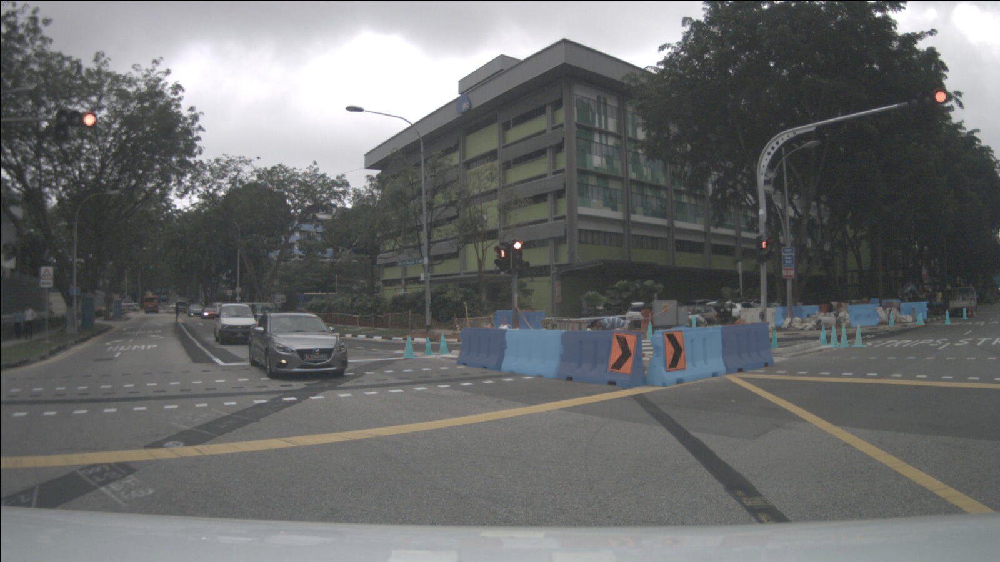
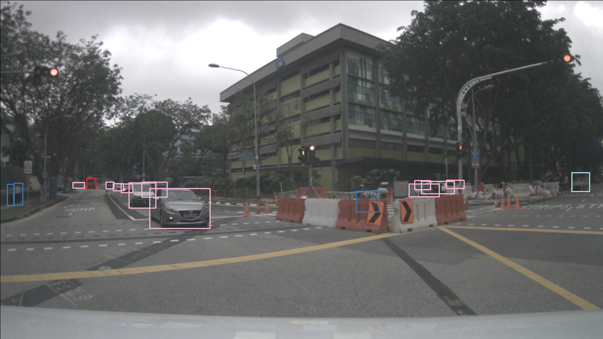

# Система распознавания статических и динамических объектов

**Автор:**  
Крыжановский Пётр Константинович  

---

## 1. Описание проекта

Данный проект представляет собой конвейер для обучения и инференса моделей сегментации (U-Net) и детекции (YOLOv8) на датасете **nuImages**. Цель — разработать систему, способную одновременно обнаруживать динамические объекты и сегментировать статические препятствия.

Основные компоненты:
- **Сегментация (U-Net):**  
  - Скрипт `train.py` — утилиты для подготовки данных и обучения U-Net-модели сегментации на разметке датасета nuImages.
- **Детекция (YOLOv8):**  
  - Скрипт `yolo_train.py` — утилиты для подготовки данных и обучения детектора YOLOv8 на выбранных классах динамических объектов.  
  - Конфигурационный файл `nuimages.conf` содержит все необходимые настройки (пути до данных, гиперпараметры и т.д.) для обучения YOLOv8 на nuImages.  

Помимо модулей обучения, проект включает скрипты для инференса обученных моделей и демонстрации полученных результатов (примеры сегментации и детекции).

---

## 2. Структура проекта

```

├── .gitignore
├── README.md
├── requirements.txt
├── nuimages.yaml               # Конфиг для загрузки/преобразования данных nuImages
├── nuimages.conf               # Конфигурация для обучения YOLOv8
├── yolov8n.pt                  # Предобученные веса YOLOv8n (опционально)
│
├── train.py                    # Скрипт/модуль для обучения U-Net сегментации
├── yolo\_train.py               # Скрипт/модуль для обучения YOLOv8
├── yolo\_main.py                # Основной скрипт для инференса YOLOv8
├── trainers.py                 # Общие классы и функции для обучения моделей
│
├── ros2\_ws/                     # (опционально) Пакет ROS2 для интеграции модели в систему робота
│   └── …
│
├── docs/                       # Вспомогательные файлы документации и примеры
│   ├── segmentation\_example.png  # Пример результата сегментации (U-Net)
│   └── detection\_example.png     # Пример результата детекции (YOLOv8)

````

- `requirements.txt` — зависимости проекта.
- `nuimages.yaml` — YAML-файл для загрузки и преобразования датасета nuImages (для U-Net).
- `nuimages.conf` — конфигурация для обучения YOLOv8 (пути до тренировочных/валидационных аннотаций, гиперпараметры и т.д.).
- `train.py` — код, реализующий:
  - Разметку и препроцессинг изображений/масок из nuImages для сегментации.
  - Определение архитектуры U-Net (или её модификаций).
  - Тренировочный цикл, логи метрик, сохранение чекпоинтов.
- `yolo_train.py` — код, реализующий:
  - Конвертацию аннотаций nuImages в формат, понятный YOLOv8.
  - Сборку датасета `.yaml` (список путей к картинкам и аннотациям).
  - Запуск обучения YOLOv8 (модель YOLOv8n или другая) с указанными гиперпараметрами.
- `yolo_main.py` — скрипт для выполнения инференса детектора на произвольных изображениях и сохранения/визуализации результатов.
- `trainers.py` — вспомогательные классы, функции и общие утилиты для обучения обеих моделей (загрузка данных, визуализация, вычисление метрик и т.д.).
- `ros2_ws/` — пример пакета ROS2 для интеграции обученных моделей в ROS-пайплайн (необязательно при локальной отладке).

---

## 3. Установка зависимостей

1. Склонируйте репозиторий:
   ```bash
   git clone https://github.com/your_username/nuimages_detection_segmentation.git


2. Создайте виртуальное окружение (рекомендуется `venv` или `conda`) и активируйте его. Например:

   ```bash
   python3 -m venv .venv
   source .venv/bin/activate
   ```

3. Установите все необходимые пакеты:

   ```bash
   pip install --upgrade pip
   pip install -r requirements.txt
   ```

> **Примечание:**
>
> * В `requirements.txt` должны быть перечислены версии всех основных библиотек (PyTorch, torchvision, OpenCV, ultralytics/yolov8, numpy, pandas и т.д.).
> * Если вы планируете собирать пакет ROS2 (папка `ros2_ws/`), убедитесь, что у вас установлен ROS2 Foxy.

---

## 4. Подготовка данных (nuImages)

Для обучения моделей используется датасет [nuImages](https://www.nuscenes.org/nuimages). Предполагается, что вы уже скачали nuImages и разархивировали его в локальную папку (например, `~/datasets/nuimages/`).

1. Откройте файл `nuimages.yaml` и укажите:

   * Путь к директории с изображениями (обычно `samples/`)
   * Путь к директории с аннотациями в формате COCO или специальном формате nuImages
   * Параметры аугментации (опционально)

2. Для обучения сегментации (`train.py`) следует подготовить:

   * Усечённые (cropped) или полные изображения `*.jpg`/`*.png`
   * Маски сегментации статических элементов (дороги, тротуары и т.п.) в формате `PNG` с индексами классов.
   * Файлы-списки (CSV/JSON) с путями к изображениям и маскам (скрипт `train.py` может генерировать такие списки сам).

3. Для обучения детектора YOLOv8 (`yolo_train.py`) необходима структура:

   ```
   datasets/
   ├── images/
   │   ├── train/
   │   ├── val/
   └── labels/
       ├── train/
       └── val/
   ```

   где каждая метка `labels/*.txt` соответствует одной картинке `images/*.jpg` и хранит координаты боксов в формате YOLO (`class_id x_center y_center width height`).
   * Запустите `trainers.py` для дополнения датасета до необходимого вида.
   * Запустите `yolo_train.py`, чтобы автоматически конвертировать аннотации nuImages в структуру YOLOv8.

---

## 5. Обучение моделей

### 5.1 Обучение U-Net (сегментация)

```bash
python train.py \
    --epochs 50 \
    --batch-size 8 \
    --lr 0.001 \
    --save-dir checkpoints/unet/
```

Где:

* `--config nuimages.yaml` — путь к файлу с настройками (пути до данных, параметры аугментации, целевые классы сегментации).
* `--epochs` — количество эпох обучения.
* `--batch-size` — размер батча.
* `--lr` — начальный learning rate.
* `--save-dir` — директория для сохранения чекпоинтов модели U-Net.

По окончании обучения будут сохранены:

* Последний чекпоинт (например, `unet_epoch49.pth`).

### 5.2 Обучение YOLOv8 (детекция)

```bash
python yolo_train.py \
    --config nuimages.conf \
    --epochs 100 \
    --batch-size 16 \
    --img-size 640 \
    --weights yolov8n.pt \
    --save-dir checkpoints/yolov8/
```

Где:

* `--config nuimages.conf` — путь к конфигурационному файлу, в котором прописаны:

  * Пути к `train/val/images` и `train/val/labels`.
  * Список классов динамических объектов (Car, Pedestrian, Cyclist и т.д.).
  * Гиперпараметры (learning rate, scheduler, размеры аугментаций и т.д.).
* `--epochs`, `--batch-size`, `--img-size` — параметры обучения.
* `--weights` — предобученные веса YOLOv8 (можно использовать `yolov8n.pt` для запуска «с нуля» или задать свои).
* `--save-dir` — директория для сохранения чекпоинтов детектора.

После завершения обучения будут сохранены:

* Лучшие веса модели (`best.pt`).

---

## 6. Инференс и демонстрация результатов

### 6.1 Инференс U-Net (сегментация)

Пример запуска скрипта для сегментации одного изображения:

```bash
python train.py \
    --inference \
    --weights checkpoints/unet/unet_epoch49.pth \
    --input-img path/to/input.jpg \
    --output-mask path/to/output_mask.png
```

* `--inference` — режим инференса (отличается от режима обучения).
* `--weights` — путь до сохранённых весов модели.
* `--input-img` — путь к тестовому изображению.
* `--output-mask` — путь для сохранённой маски сегментации.

### 6.2 Инференс YOLOv8 (детекция)

Используйте готовый скрипт для детекции:

```bash
python yolo_main.py \
    --weights checkpoints/yolov8/best.pt \
    --source path/to/test_images/ \
    --output results/detections/ \
    --conf-thres 0.25 \
    --iou-thres 0.45
```

* `--weights` — путь до обученных весов YOLOv8.
* `--source` — папка (или файл) с изображениями для детекции.
* `--output` — директория для сохранения результатов (изображения с нарисованными боксами и метками).
* `--conf-thres` / `--iou-thres` — пороги confidence и NMS соответственно.

---

## 7. Примеры работы

Ниже приведены примеры результатов работы репозитория.

### 7.1 Сегментация (U-Net)



> На данном изображении показана сегментация статических дорожных препятствий.

### 7.2 Детекция (YOLOv8)



> На данном изображении показана детекция динамических объектов.

---

## 8. Лицензия

Проект распространяется под лицензией MIT.
Полный текст лицензии находится в файле [`LICENSE`](LICENSE).

---

## 9. Дополнительные заметки

1. **ROS2-интеграция.**
   Если вы планируете использовать результаты в среде ROS2, перейдите в папку `ros2_ws/` и выполните сборку рабочей области:

   ```bash
   cd ros2_ws/
   colcon build
   source install/setup.bash
   ```

   Затем используйте ноды для подписки на топики с изображениями и публикации результатов детекции/сегментации.

2. **Расширение и дообучение.**

   * Вы можете изменить архитектуру U-Net в файле `train.py/UNet` под свои нужды (добавить больше уровней, заменить энкодер на предобученный Backbonе и т.п.).
   * Аналогично, в `yolo_train.py` можно переключаться между YOLOv8n, YOLOv8s, YOLOv8m и т.д., меняя путь к весам и внося правки в `nuimages.conf`.

3. **Совместимость.**

   * Рекомендуемая версия Python: `3.8`.
   * Приведённый `requirements.txt` был протестирован с PyTorch `1.13+`, `ultralytics` `8.0+`.

---

Спасибо за внимание! Если возникнут вопросы или проблемы при запуске — открывайте issue в репозитории или пишите автору напрямую.
